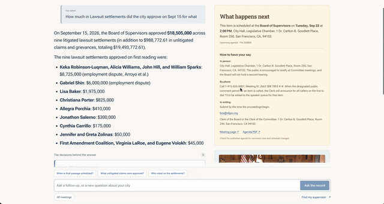
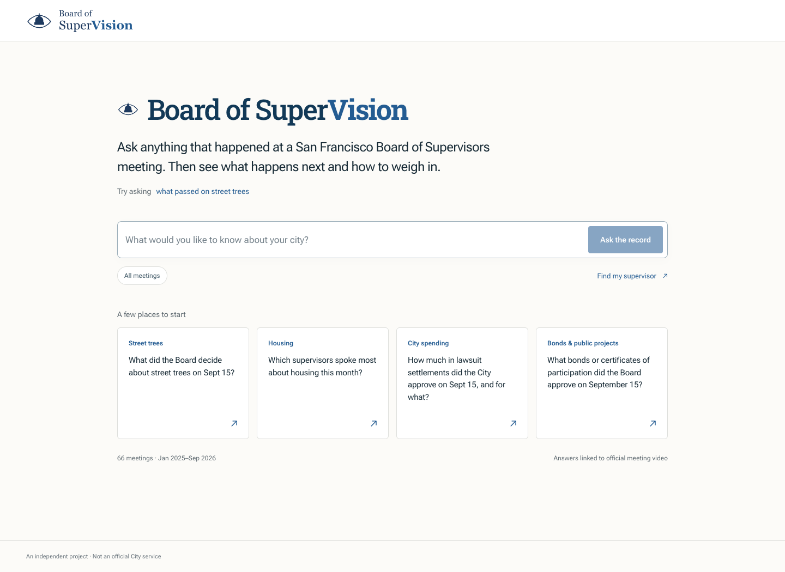
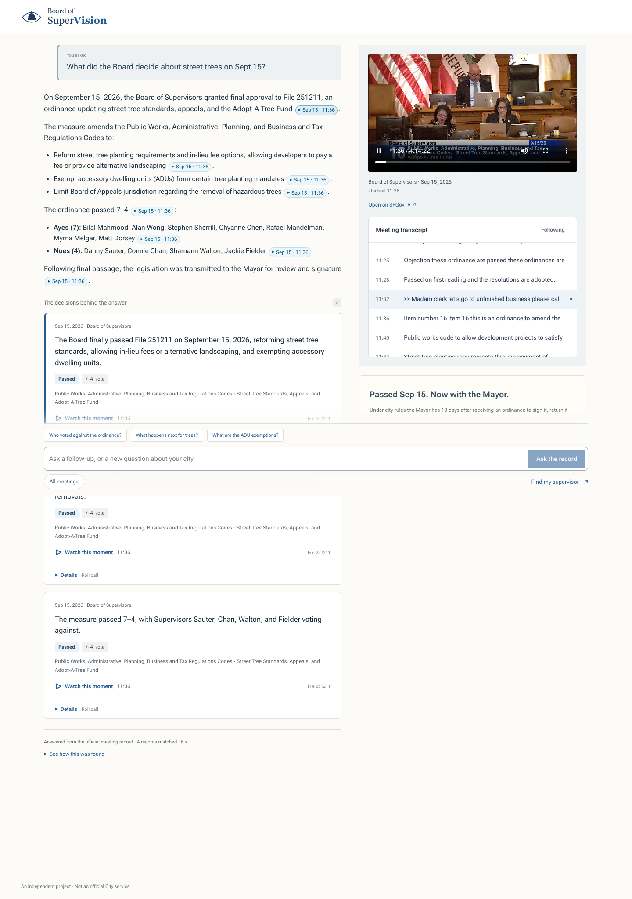
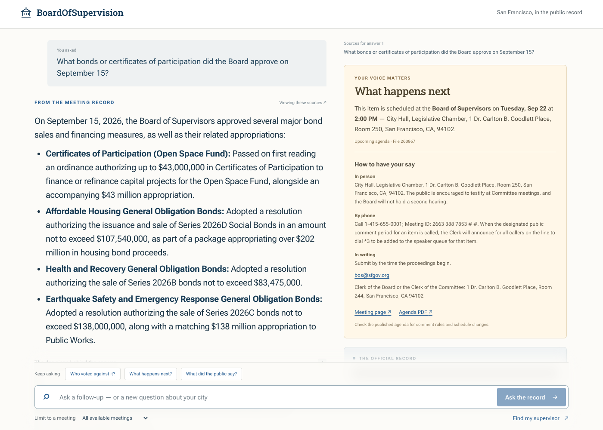
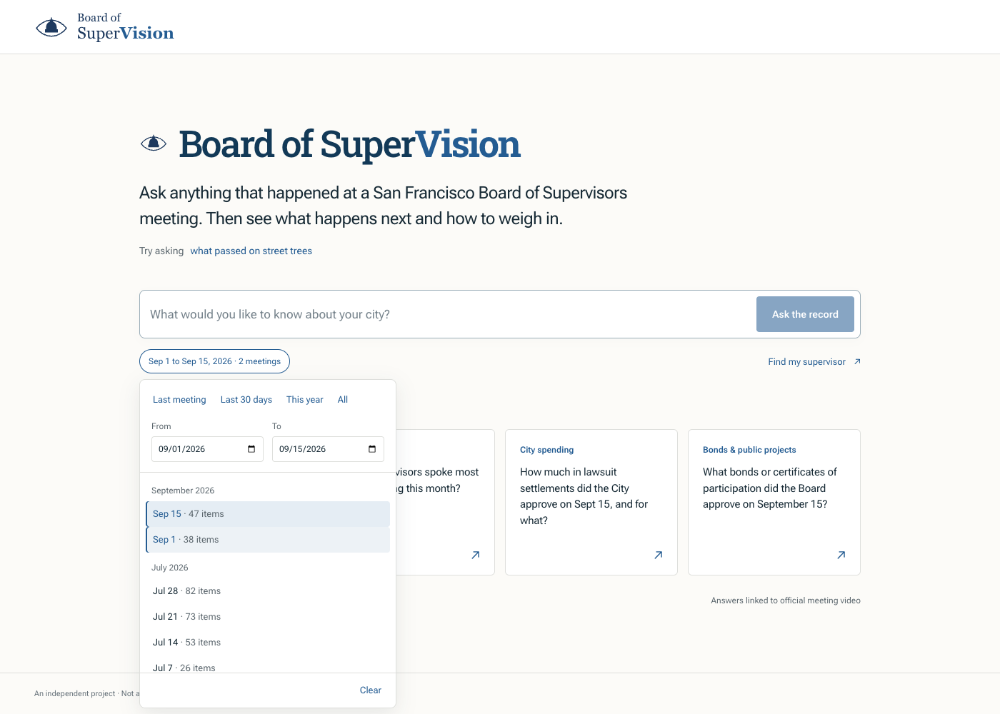
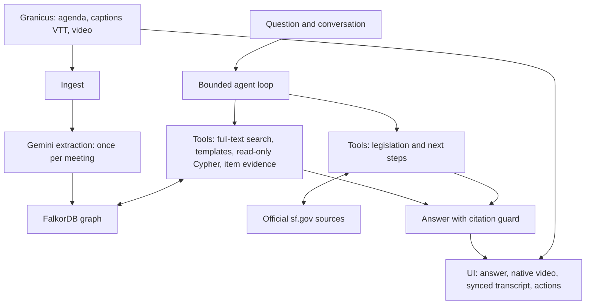

<p align="center"></p>

# Board of SuperVision

**Ask what San Francisco's Board of Supervisors said and decided. Watch the evidence. Find your next step.**

**Every captioned Board meeting since January 2025: 66 meetings.** A **7,553-node graph** connects **6,961 recorded votes** and **1,181 timestamped quotes**.

From a four-hour meeting to a sourced answer in seconds: **5.6-second median response time** across **30/30 passing evaluation questions**.

## Demo

[](docs/demo.mp4)

[Watch the full 21-second demo](docs/demo.mp4).

## What it does

- **Ask anything about a meeting.** Get a plain-English answer with cited claims linked to the relevant moment in official SFGovTV video, down to the second when timed evidence is available.
- **Check the record yourself.** See votes, quotes, and a transcript synchronized with the native video player. Follow-up questions keep the conversation, while the Graph panel exposes the retrieval behind the answer.
- **See what happens next and how to weigh in.** Find upcoming hearings, legislation, participation instructions, sponsor and clerk contacts, and your own supervisor from official sources.

| Start with a question | Answer beside the official video and transcript |
| --- | --- |
|  |  |
| **What happens next** | **Choose the meetings to search** |
|  |  |

## A real example

**Question:** What did the Board decide about street trees on Sept 15? Include the vote tally and who voted no.

An actual answer saved in [`data/evals/last_run.json`](data/evals/last_run.json):

> On September 15, 2026, the Board of Supervisors finally passed an ordinance (File 251211) reforming street tree planting standards, appeals, and the Adopt-A-Tree Fund. The ordinance allows developers to pay an in-lieu fee or provide alternative landscaping, exempts accessory dwelling units from certain tree requirements, and restricts Board of Appeals jurisdiction over hazardous tree removals.
>
> The measure passed with a vote tally of **7–4**. Supervisors **Connie Chan**, **Jackie Fielder**, **Danny Sauter**, and **Shamann Walton** voted no. The ordinance now proceeds to the Mayor for signature, return unsigned, or veto.

Its cited evidence card reads: “The Board approved File 251211 on final passage 7–4, with Chan, Fielder, Sauter, and Walton voting no.” [Watch the official video, September 15, item 1262853](https://sanfrancisco.granicus.com/player/clip/53160?view_id=10&meta_id=1262853&redirect=true), beginning at **11:36**.

## How it works

**Gemini 3.8 Flash** extracts each meeting once, then answers questions by querying a FalkorDB graph rather than repeatedly reading whole transcripts. Official sf.gov pages supply legislation context and action opportunities. The React interface keeps answers, evidence, video, and participation information together.



The agent chooses tools for up to five retrieval rounds within a 45-second budget. Search discovers relevant items; parameterized templates answer common graph questions; read-only Cypher handles questions that need a different traversal. Item evidence expands a citation into its summary, vote tally, speakers, and timed quotes.

## Why a graph

A legislative file can appear in several meetings, as a standalone item or inside a consent agenda. A graph preserves those identities and connects them to supervisors, votes, quotes, topics, and public-comment themes. That makes questions such as “Who dissents together?” or “Where has this bill been heard?” traversals over the record, not guesses from similar-looking text.

For example, this query ran against the live graph used for this release:

```cypher
MATCH (a:Supervisor)-[:VOTED {vote: 'no'}]->(i:Item)
      <-[:VOTED {vote: 'no'}]-(b:Supervisor)
WHERE a.name < b.name
RETURN a.name AS supervisor_a, b.name AS supervisor_b,
       count(DISTINCT i) AS shared_no_votes
ORDER BY shared_no_votes DESC, supervisor_a, supervisor_b
LIMIT 3
```

| Supervisor A | Supervisor B | Shared no-vote items |
| --- | --- | ---: |
| Jackie Fielder | Shamann Walton | 39 |
| Connie Chan | Jackie Fielder | 28 |
| Connie Chan | Shamann Walton | 26 |

The [`dissent_blocs`](backend/templates.py) template also returns every supporting item citation; `bill_timeline(file_no)` connects a bill's appearances across meetings, including consent agendas.

## Data

**66 full-Board meetings, January 8, 2025 through September 15, 2026.** The published meeting JSON files all have matching structured extracts. Live counts captured on September 19, 2026 with `MATCH (n) RETURN labels(n)[0], count(*)`:

| Node type | Count |
| --- | ---: |
| Meeting | 66 |
| Item | 2,501 |
| SubItem | 1,320 |
| Legislation | 2,070 |
| Quote | 1,181 |
| Supervisor | 12 |
| Speaker | 11 |
| Topic | 14 |
| Theme | 378 |
| **Total** | **7,553** |

- **1,181 timestamped quotes**, including 826 verified against normalized captions in their timed evidence window.
- **6,961 recorded votes** connect supervisors to the decisions they made.
- **Efficient extraction:** the [recent-run summary](data/raw/backfill/run-2025-01-01-9999-12-31.json) records $3.01 for 25 newly extracted meetings, about **$0.12 per meeting**. Existing extracts are reused without another extraction call.
- **Ready to explore:** all 66 extracts, matching meeting records, and their caption files are included, alongside official-source caches and evaluation results.
- **Video and transcript together:** official meeting video streams through the backend, while the included `data/raw/<clip>/captions.vtt` files power `/api/captions` and the synchronized transcript panel.

## Run it locally

Prerequisites: Python 3.12+, [uv](https://docs.astral.sh/uv/), Node.js with npm, an LLM API key (`OPENROUTER_API_KEY`), and FalkorDB Cloud or Docker. Run commands from the repository root unless shown otherwise.

```sh
uv sync
cp .env.example .env
```

Set these values in `.env` (never commit credentials):

```dotenv
LLM_MODEL=google/gemini-3.8-flash
OPENROUTER_API_KEY=your-key-here
FALKORDB_URL=redis://localhost:6379
FALKORDB_GRAPH=bos
```

For a local graph, start FalkorDB in a separate terminal:

```sh
docker run -p 6379:6379 falkordb/falkordb
```

Alternatively, use the connection URL from your FalkorDB Cloud instance. Load the committed corpus and start the backend:

```sh
uv run -m backend.seed
uv run -m backend.load
uv run uvicorn backend.main:app --port 8000
```

Then start the frontend in another terminal:

```sh
cd frontend
npm i
npm run dev
```

Open `http://localhost:5173`. Vite proxies `/api` to port 8000. The app uses the live API by default; `?mock=1` explicitly selects bundled demonstration fixtures. API keys stay in the backend.

To refresh the ingest cache or extract additional meetings, use `uv run -m backend.ingest --limit 70`, then `uv run -m backend.extract --all` and `uv run -m backend.load`. Extraction calls the model; loading existing extracts does not.

### Evals

With the backend running:

```sh
uv run -m backend.evals
```

The [evaluation harness](backend/evals.py) exercises real questions and checks answer properties, expected citations, and the retrieved-item citation invariant. Explore [`data/evals/questions.json`](data/evals/questions.json) and [`data/evals/last_run.json`](data/evals/last_run.json) for questions, checks, tool traces, and saved answers.

## API

**Contract 4:** `POST /api/ask` takes a question, optional meeting filter, optional location, and up to six conversation turns:

```json
{
  "question": "What did the Board decide about street trees?",
  "clip_ids": [53160],
  "history": [],
  "lat": 37.7695,
  "lon": -122.4463
}
```

The response retains `answer`, `bullets`, `retrieval`, and `latency_ms`. Each bullet has `text`, `clip_id`, `meta_id`, optional `t0`, `date`, `item_title`, and an official-video `url`.

Additive fields are optional and consumers should tolerate their absence:

| Field | Meaning |
| --- | --- |
| `suggestions` | Three short follow-up questions, with a static fallback if malformed. |
| `citations` | Retrieved-only `{key, clip_id, meta_id, t0?, date, item_title, url}` records. Prose can contain `[[clip:meta]]` or `[[clip:meta@t0]]` markers; invalid markers are stripped. |
| `retrieval.mode`, `steps`, `rows`, `cypher` | Default mode `agent`; tool trace `{n,tool,source,args,rows,ms,note?}`; deduplicated graph rows; last executed query. Sources are `falkordb`, `sfgov`, or `local`. |
| `bullets[].evidence` | Summary, outcome, topics, section, file number, time range, votes with `inferred`, tally, speakers, quotes, and video URL. |
| `bullets[].legislation` | Exact file match with title, sponsors, nullable fiscal impact, history, phase, current committee/clerk, documents, source links, and whether your supervisor serves on that committee. |
| `bullets[].actions` | Discriminated source-backed next steps: `upcoming_agenda`, `interpretation_or_ada_request`, `contact_sponsor`, `contact_committee_clerk`, `mayor_review`, or `election_measure`. Unsupported actions remain absent. |
| `supervisor` | District and official contact/profile details from the supplied location. |

Upcoming agendas include time, place, exact agenda item, source/PDF URLs, and in-person, remote, and written participation details. Mayor review includes `deadline_basis`; election-measure matches require both the election date and an explicit measure letter. Conversation history uses `{role, content, cited?}`; prior citations are context only and must be retrieved again.

`POST /api/ask/stream` accepts the same body and emits server-sent events: `step` (tool trace), `answer_delta` (`{text,citations?}`), `result` (full Contract 4 response), `error` (`{message}`), and `done` (`{}`). The final `result` is authoritative.

Other endpoints: `GET /api/meetings` (graph-loaded meetings with `loaded: true`, cached for 60 seconds), `GET /api/health`, `GET /api/video/{clip_id}/meta`, range-enabled `GET|HEAD /api/video/{clip_id}`, and `GET /api/captions/{clip_id}.vtt`.

## Architecture

- **Gemini-powered extraction and reasoning.** Structured extraction builds a reusable record; tool-driven reasoning answers new questions from that graph.
- **A hand-rolled loop, not another orchestration framework.** Existing provider clients already cover the needed boundary; [`backend/agent/loop.py`](backend/agent/loop.py) is the bounded conversation and debugging entry point.
- **Provider-neutral sessions.** The `ToolCall`/`Session` boundary retains native tool-call IDs and messages instead of translating away provider semantics.
- **Read-only retrieval.** Graph tools use `ro_query`, reject write syntax, and cap literal limits at 100 rows. A request-local trace supplies the allowed citation IDs.
- **Bounded work.** Five retrieval rounds and 45 seconds force synthesis from available evidence rather than unbounded tool calling. `ASK_MODE=agent` is default; `ASK_MODE=pipeline` retains the earlier route with mode-separated caching and exception fallback.
- **Streaming follows research.** A separate provider streaming composition pass uses the finish bullets and retrieved rows, without parsing partial tool-call JSON.
- **The same citation guard applies before streamed prose is emitted.** Streaming composition remains inside the bounded request budget.
- **The synchronous `/api/ask` contract remains available.** Streaming adds an endpoint rather than changing existing clients' response shape.
- **Plain React and CSS.** No UI kit or state framework is needed for an evidence workspace. The app controls a native video element instead of embedding an entire third-party player page.

## What's next

- Follow a bill from introduction to decision on a dedicated timeline page.
- Get personal alerts for topics, legislation, and upcoming hearings.
- Explore more years of San Francisco's public record.
- Ask across committees, commissions, and other public bodies.
- Connect audio-based speaker and vote attribution directly to the recording.

## Credits

Built at **Hack for Humanity SF, September 19, 2026**. Powered by **Gemini** and **FalkorDB**. Meeting agendas, captions, and video come from [SFGovTV / Granicus](https://sanfrancisco.granicus.com/ViewPublisher.php?view_id=10); legislation context and participation information come from [sf.gov](https://www.sf.gov/).

An independent civic-tech project, not a City service. The official record belongs to its original sources.
